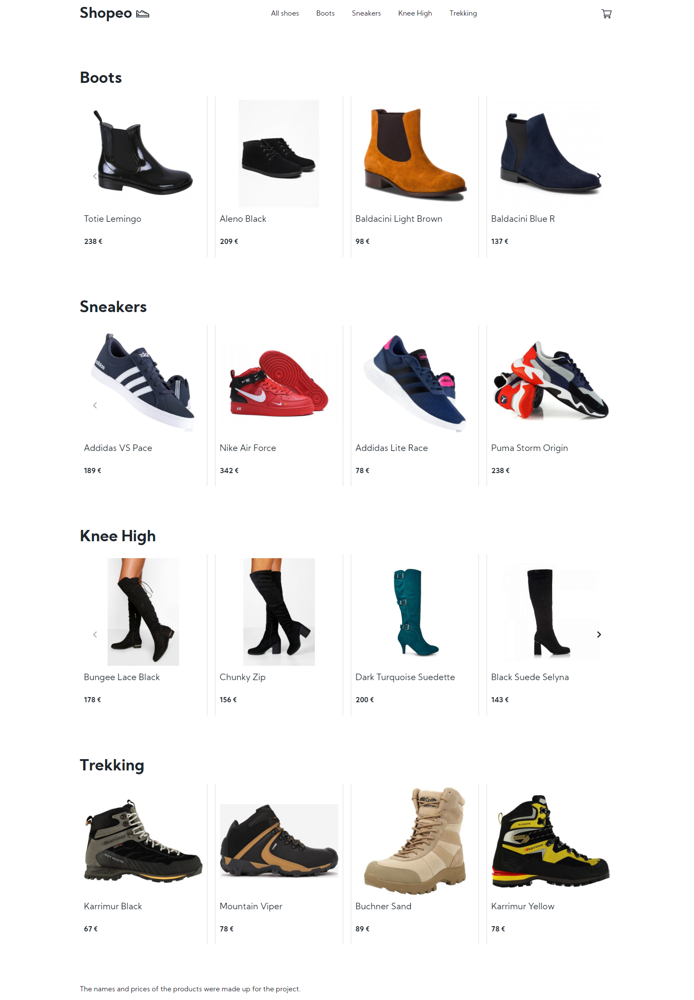

<!-- PROJECT LOGO -->
<br />
<p align="center">
    
    <h3  h3 align="center">Shopeo</h3>

  <p align="center">
    Shopeo is a shop with shoes.
    <br />
    <br />
    [View Demo](https://shopeo.netlify.app/)
    ·
    <a href="https://github.com/piotrglodek/shopeo/issues">Report Bug</a>
  </p>
</p>

<!-- TABLE OF CONTENTS -->

## Table of Contents

- [About the Project](#about-the-project)
  - [Built With](#built-with)
  - [Prerequisites](#prerequisites)
  - [Installation](#installation)
- [License](#license)

<!-- ABOUT THE PROJECT -->

## About The Project



### Built With

- [React](https://reactjs.org)
- [GraphCMS](https://graphcms.com)
- [Swiper](https://swiperjs.com/)
- [Styled-components](https://styled-components.com/)
- [Node-sass](https://create-react-app.dev/docs/adding-a-sass-stylesheet)
- [Graphql-request](https://www.npmjs.com/package/graphql-request)
- [React-router-dom](https://reactrouter.com/)

### Prerequisites

- npm: latest
- nodejs: latest
- react: ^16.13.1
- graphql: ^15.3.0
- graphql-request: ^3.1.0
- node-sass: ^4.14.1
- react: ^16.13.1
- react-dom: ^16.13.1
- react-router-dom: ^5.2.0
- react-scripts: 3.4.3
- styled-components: ^5.2.0
- swiper: ^6.2.0

### Installation

1. Clone the repo

```sh
git clone https://github.com/piotrglodek/shopeo.git
```

2. Install NPM packages

```sh
npm install
```

3. Start server

```sh
npm start
```

<!-- LICENSE -->

## License

Distributed under the MIT License.
